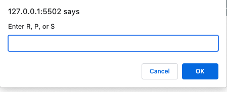

# game_time

## Table of Contents

* [Description](#description)
* [Installation](#installation)
* [Tools](#tools)
* [Specification](#Specification)
* [Contact](#contact)
* [License](#license)
* [Acknowledgements](#acknowledgements)

## Description
A classic game of rock (R), paper (P), scissors (S) that anyone can play agains an automated opponent. 

## Installation

* Clone the repo (please reference the links below).
```md 
git@github.com:Kimberly-Rodriguez/game_time.git

```


[Application-Link]( https://kimberly-rodriguez.github.io/game_time/)

## Tools

This application is built using JavaScript with methods like `alert()`, `confirm()`, and `prompt()` to collect user input and display information to the user.

## Specification

The computer's selection is a random selection to ensure a fair game. 

## Contact

If you have any questions about my work OR wish to collaborate in the future please contact me via email: krodriguez.ucla@gmail.com OR feel free to connect via GitHub: [Kimberly-Rodriguez](https://github.com/Kimberly-Rodriguez).

## License 

Licensed under the [MIT License](LICENSE).

## Acknowledgements

[UCLA Extension Coding Bootcamp](https://bootcamp.uclaextension.edu/coding/)


